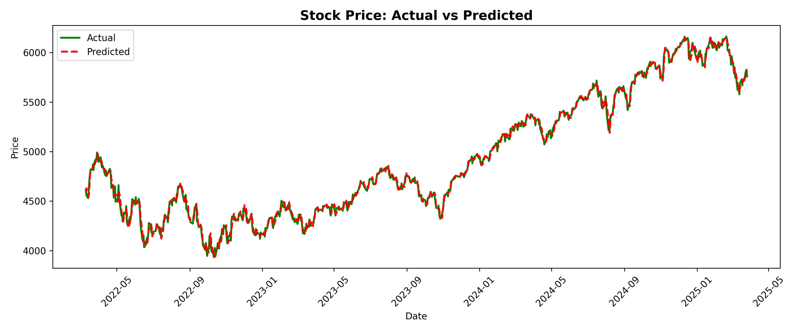
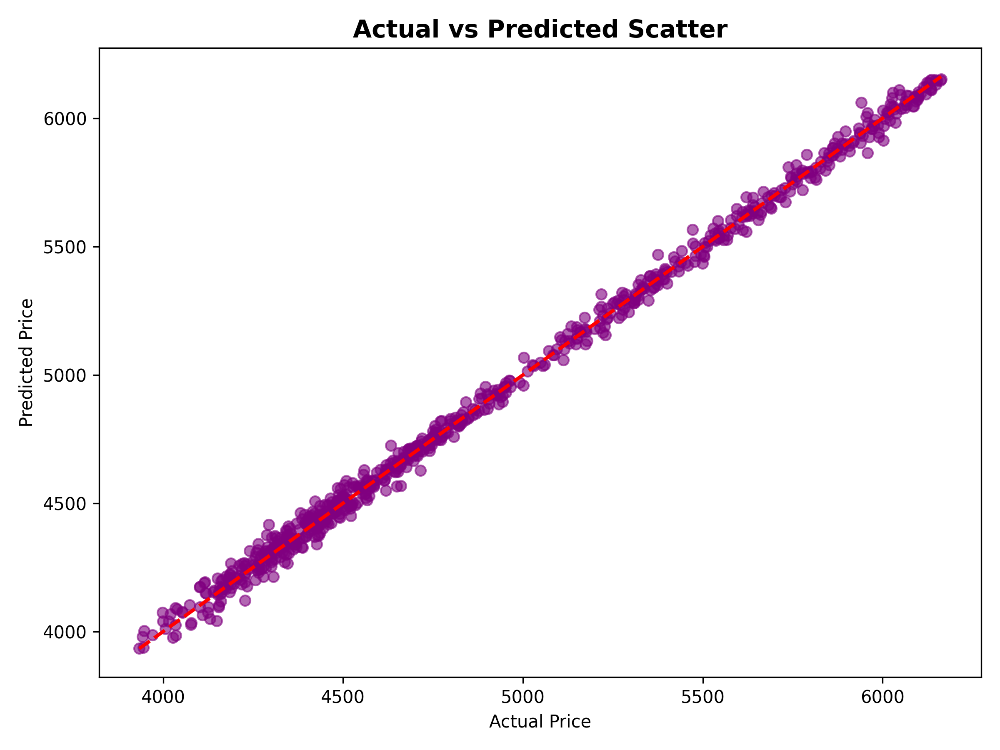
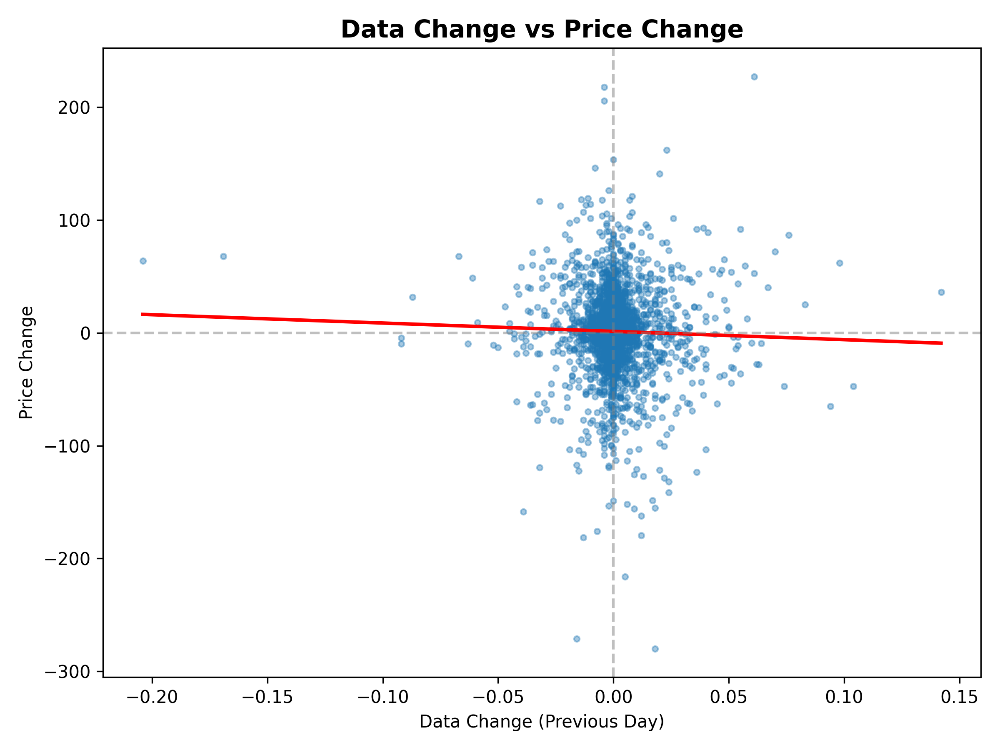
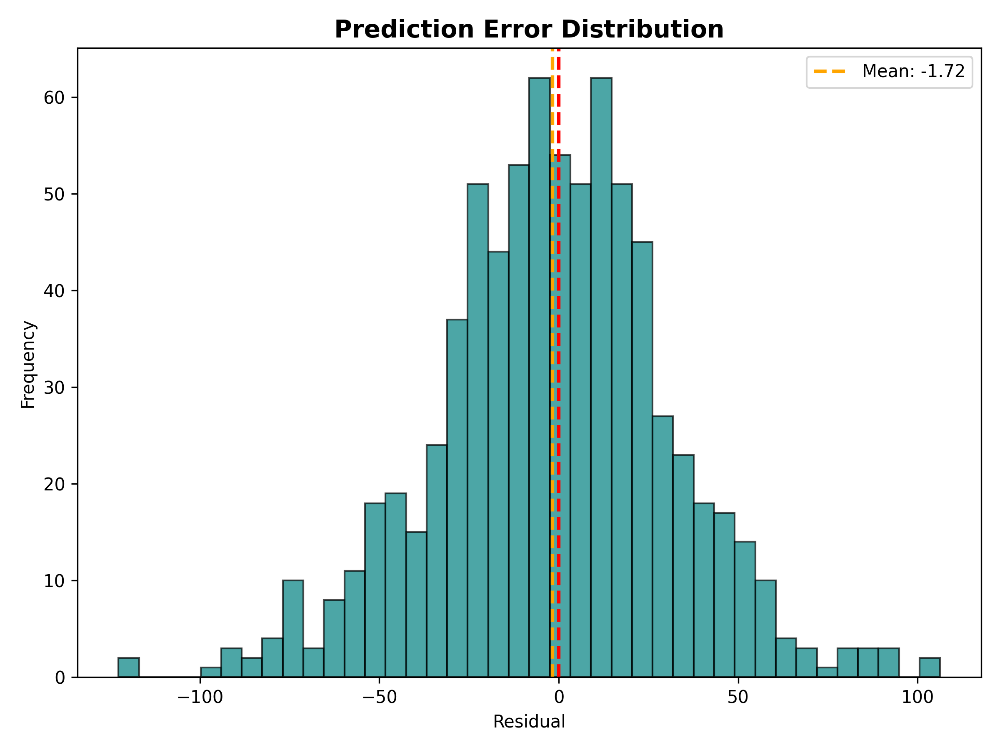

# Stock Price Prediction Model - Python Developer Intern 2026 - Futures First

***Submitted by:***
- ***Nayan Mandal (bt22csd035@iiitn.ac.in)***

***CHECK THE [model.ipynb](https://github.com/9keystrokes/Futures-First-Assignment-Python-Developer-Intern-2026/blob/main/model.ipynb) FILE FOR CODE.***

## Approach and Assumptions

### Approach
Supervised machine learning using **Linear Regression** to predict stock prices based on temporal patterns and historical data trends. 

### Key Assumptions
1. Stock price movements are primarily influenced by **day-over-day data changes** (as per assignment)
2. Historical patterns (lags, moving averages) contain predictive information
3. Linear relationships exist between engineered features and target price
4. External factors (news, sentiment, macroeconomics) are ignored per assignment constraints

## Data Preprocessing Steps

### 1. Data Loading & Merging
- Loaded Data.csv (3,902 records) and StockPrice.csv (3,839 records)
- Converted dates to datetime and sorted chronologically
- Inner join on Date → **3,802 matched records**

### 2. Feature Engineering (25 features)
**Lag Features**: 5-day historical data values and changes  
**Moving Averages**: 3, 5, 7, 14-day windows for data and price  
**Change Metrics**:  Daily change and percentage change  
**Momentum**: 5-day data momentum  
**Temporal**: Day of week, month, year

### 3. Data Cleaning & Scaling
- Dropped NaN rows from rolling operations → **3,789 final records**
- Applied **StandardScaler** to normalize features
- **Train-test split**: 80% train (3,031) / 20% test (758)

## Model Selection and Evaluation

### Model: Linear Regression
**Why?** Interpretable, efficient, and effective for time-series with engineered features

### Performance Metrics
| Metric | Value | Interpretation |
|--------|-------|----------------|
| **R² Score** | 0.9972 | 99.72% variance explained |
| **RMSE** | 32.89 | ±32.89 price units error |
| **MAE** | 25.32 | Average absolute error |
| **MAPE** | 0.53% | Average 0.53% error |

### Impact Analysis (Data Change vs Price Change)
| Metric | Value |
|--------|-------|
| Correlation | -0.0283 (weak) |
| P-value | 0.0817 (not significant) |

**Finding**: Direct data changes show weak correlation, but **engineered features capture predictive patterns**. 

## Key Insights and Conclusions

### Model Performance
- **Exceptional accuracy** with R² = 0.9972 and MAPE = 0.53%
- **Residuals centered at zero** confirming unbiased predictions
- **Strong generalization** across 758 unseen test samples

### Feature Insights
- **Lag features and moving averages** are primary drivers of accuracy
- **Temporal patterns** outperform raw data changes in predictive power
- **Feature engineering** transforms weak signals into strong predictions

### Statistical Findings
- Day-to-day data changes have **no significant direct correlation** with price (p=0.0817)
- Success comes from **historical patterns** (lags/moving averages), not instantaneous changes
- Stock prices exhibit strong **autocorrelation** (past predicts future)

### Visualizations

*Model tracks actual prices with minimal deviation*

*Tight clustering around diagonal confirms R² = 0.9972*

*Weak direct correlation between data changes and price changes*

*Normal error distribution centered at zero*

### Conclusion
The model achieves **professional-grade accuracy (0.53% MAPE)** through smart feature engineering rather than complex algorithms. While direct data-price correlation is weak, **temporal dependencies** captured by lags and moving averages drive prediction success.  Key lesson: **thoughtful feature design > algorithm complexity** for time-series forecasting.
